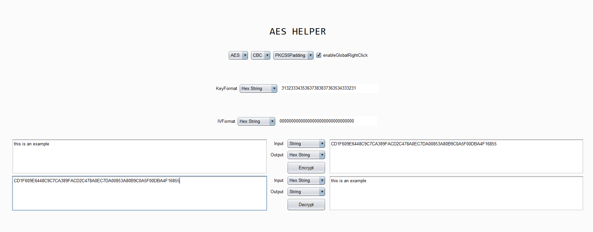
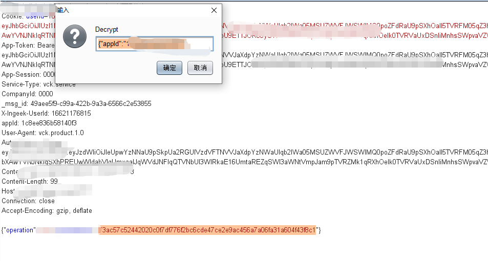
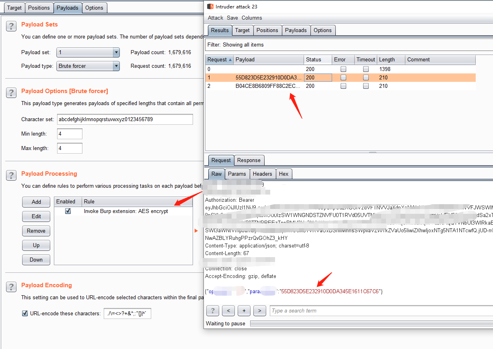

##BurpSuite AES插件
1. 实现了AES加密，解密界面功能 

2. 实现了右键加密，解密功能 

3. 实现了intruder-payloads-payload processing参数加密功能。 

###使用
除加解密界面之外，其他功能默认读取加解密界面参数，所以，在使用之前请先配置线管加解密方法，key，iv参数格式与参数，
输入输出格式。 
谢谢 

你也可以直接修改我的方法。