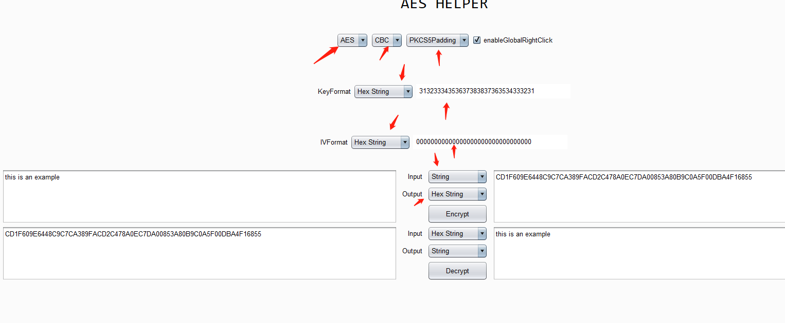
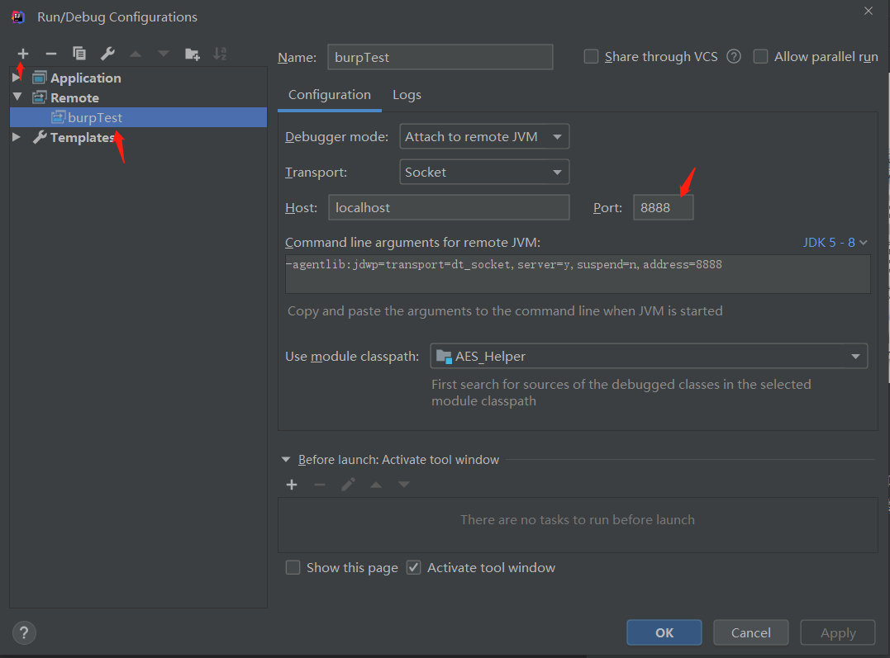

## BurpSuite AES插件
1. 实现了AES加密，解密界面功能 

2. 实现了右键加密，解密功能 

3. 实现了intruder-payloads-payload processing参数加密功能。 
 

### 使用
除加解密界面之外，其他功能默认读取加解密界面参数，所以，在使用之前请先配置线管加解密方法，key，iv参数格式与参数，
输入输出格式后选择enableGlobal。 
 
谢谢 

写出来测试了了一下，基本ok，但是bug是有的，所以你也可以直接修改我的方法，毕竟我可能会直接弃坑了。

### 调试插件
java -agentlib:jdwp=transport=dt_socket,server=y,suspend=n,address=8888 -jar burpsuite_community_1.7.33-9.jar
idea配置： 
 

